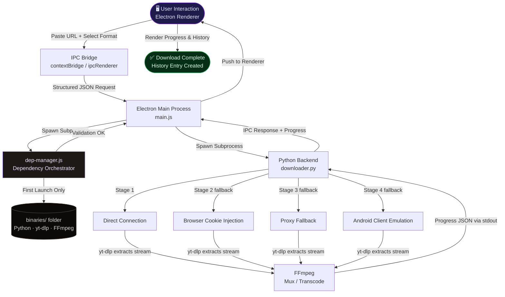

<div align="center">

<!-- LOGO PLACEHOLDER: Replace with your actual logo -->


<br/>
<br/>

# Dany Desktop

**A premium, open-source desktop media downloader built for the modern era.**  
Download from YouTube, Spotify, Instagram, and Pinterest — beautifully.

<br/>

[](https://opensource.org/licenses/MIT)
[](https://github.com/forex911/dany-desktop/releases)
[](https://github.com/forex911/dany-desktop/releases)
[](https://github.com/forex911/dany-desktop/stargazers)

<br/>

<!-- SCREENSHOT PLACEHOLDER -->
> 📸 **Screenshot coming soon** — place your app screenshot here (`assets/screenshot.png`)

</div>

---

## The Philosophy

Most media downloaders are utilitarian tools bolted together with duct tape and hope. **Dany Desktop is different.**

It's built on a single conviction: that powerful software should also be *beautiful* software. Every pixel, animation, and interaction has been considered. The result is a frameless, glassmorphic desktop experience that feels as refined as a macOS native app — running flawlessly on Windows.

Zero bloat. Zero setup. Just open it and download.

---

## ✦ Features

### 🎨 Premium Interface, First-Class Experience

- **Frameless Glassmorphism UI** — A stunning dark-mode window with frosted glass overlays, custom title bar controls, and smooth micro-animations that rival top-tier design tools like Notion and Arc Browser
- **Platform-Aware Color Shifting** — Each supported platform (YouTube, Spotify, Instagram, Pinterest) renders with its own signature color palette, making the UI feel native to the content you're downloading
- **Buttery Smooth Animations** — Every state transition, dropdown reveal, and progress update is animated with precision — no jank, no flicker

### ⚡ Zero-Setup Architecture

- **Fully Self-Configuring** — On first launch, Dany automatically detects, downloads, and installs isolated instances of **Python**, **yt-dlp**, and **FFmpeg** directly into the app's local `binaries/` folder
- **No System Variables Required** — Nothing is written to your `PATH`. The user never opens a terminal. It just works.
- **Automatic Dependency Validation** — Every launch silently verifies binary integrity and self-heals if anything is missing or outdated

### 🛡️ Four-Stage Resilient Extraction

Built to win against rate limits, paywalls, and anti-bot measures. The backend never gives up:

| Stage | Strategy | Purpose |
|---|---|---|
| **1** | Direct Connection | Fastest path; works for most public content |
| **2** | Browser Cookie Injection | Unlocks age-gated and authenticated content |
| **3** | Proxy Fallback | Bypasses geo-restrictions and IP-based rate limits |
| **4** | Android Client Emulation | Last-resort bypass for stubborn `402` errors |

### 🎯 Intelligent Format Selection

- Automatically parses and ranks every available stream — `4K`, `1080p`, `720p`, `480p`, and **audio-only** — from the source URL
- Presents formats in a clean, human-readable dropdown with file size estimates
- Smart logic prefers **progressive MP4** (single-file video+audio) to avoid merge artifacts

### 🕓 Persistent Download History

- A full, scrollable history of every **completed**, **failed**, and **cancelled** download
- **Thumbnail previews** for every entry — so you always know what you downloaded at a glance
- History persists across app restarts

### 🌐 Multi-Platform Support

| Platform | Content Types |
|---|---|
| **YouTube** | Videos, Shorts, Playlists |
| **Spotify** | Tracks, Albums, Playlists |
| **Instagram** | Reels, Posts, Carousels |
| **Pinterest** | Images, Videos, Idea Pins |

---

## 🏗️ Architecture

Dany Desktop uses a clean **dual-layer architecture** that keeps the UI blazing fast and all heavy processing safely offloaded to the background.

**Frontend:** Electron + Vanilla JS/HTML/CSS (no frameworks — zero overhead)  
**Backend:** Invisible Python subprocesses powered by `yt-dlp` and `FFmpeg`

### How It Works



---

## 🚀 Getting Started

> **For end users:** Simply download the installer from the [Releases](https://github.com/forex911/dany-desktop/releases) page. No setup required — the app manages everything itself.

The following guide is for **developers** who want to run the project from source.

### Prerequisites

| Dependency | Minimum Version | Notes |
|---|---|---|
| [Node.js](https://nodejs.org/) | `v18+` | LTS recommended |
| [Python](https://www.python.org/) | `3.10+` | Only needed for development |
| [Git](https://git-scm.com/) | Any | For cloning |

> `yt-dlp` and `FFmpeg` are **not** required as system installs. The app manages its own isolated binaries automatically.

---

### Step 1 — Clone the Repository

```bash
git clone https://github.com/forex911/dany-desktop.git
cd dany-desktop
```

### Step 2 — Install Node.js Dependencies

```bash
npm install
```

This installs Electron and all Node-side tooling defined in `package.json`.

### Step 3 — Install Python Dependencies

```bash
pip install -r requirements.txt
```

This installs the Python packages used by the `backend/` subprocess layer (e.g., `yt-dlp`, `requests`).

> 💡 **Tip:** Use a virtual environment to keep your system clean:
> ```bash
> python -m venv .venv
> # Windows
> .venv\Scripts\activate
> # macOS / Linux
> source .venv/bin/activate
>
> pip install -r requirements.txt
> ```

### Step 4 — Launch the App

```bash
npm start
```

On first launch, the `dep-manager` will silently bootstrap all required binaries into `binaries/`. This may take 30–60 seconds on the very first run. Subsequent launches are instant.

---

## 📁 Project Structure

```
dany-desktop/
├── electron/               # Electron main process
│   ├── main.js             # App entry point, window management
│   ├── dep-manager.js      # Auto dependency downloader/validator
│   └── preload.js          # Secure IPC context bridge
│
├── frontend/               # Renderer process (UI layer)
│   ├── index.html          # App shell
│   ├── styles/             # Glassmorphism CSS, animations
│   └── scripts/            # Vanilla JS UI logic
│
├── backend/                # Python subprocess layer
│   ├── downloader.py       # Core download orchestrator
│   ├── extractor.py        # yt-dlp wrapper & fallback chain
│   └── ffmpeg_utils.py     # FFmpeg muxing helpers
│
├── binaries/               # Auto-managed runtime binaries (git-ignored)
│   ├── python/
│   ├── yt-dlp/
│   └── ffmpeg/
│
├── package.json
├── requirements.txt
└── README.md
```

---

## 🤝 Contributing

Contributions are what make open source extraordinary. All contributions are welcome — from fixing a typo to adding an entirely new platform extractor.

**To get started:**

1. **Fork** the repository
2. Create a feature branch: `git checkout -b feat/your-feature-name`
3. Commit your changes: `git commit -m 'feat: add amazing feature'`
4. Push to your branch: `git push origin feat/your-feature-name`
5. Open a **Pull Request** with a clear description of what you've changed and why

Please check for open [Issues](https://github.com/forex911/dany-desktop/issues) before starting work on something large — let's coordinate so effort isn't duplicated.

---

## 🐛 Reporting Issues

Found a bug? A platform that isn't extracting correctly? Open an [Issue](https://github.com/forex911/dany-desktop/issues/new) and include:

- The **URL** you were trying to download (or a similar public example)
- The **error message** shown in the app or terminal
- Your **OS version** and **Node.js / Python versions**

---

## ⭐ Support the Project

If Dany Desktop saves you time, delights you with its design, or just works when everything else fails —

**please consider giving it a star on GitHub.**

It takes two seconds and it means everything for an open-source project. Stars help other developers discover the project, motivate continued development, and signal that this work is worth maintaining.

<div align="center">

### [⭐ Star Dany Desktop on GitHub](https://github.com/forex911/dany-desktop)

*Thank you. Genuinely.*

</div>

---

## 📄 License

Distributed under the **MIT License**. See [`LICENSE`](LICENSE) for full details.

You are free to use, modify, and distribute this software — commercially or otherwise — with attribution.

---

<div align="center">

Built with obsession by [forex911](https://github.com/forex911) and the open-source community.

<br/>

*Great software is never finished — only released.*

</div>
